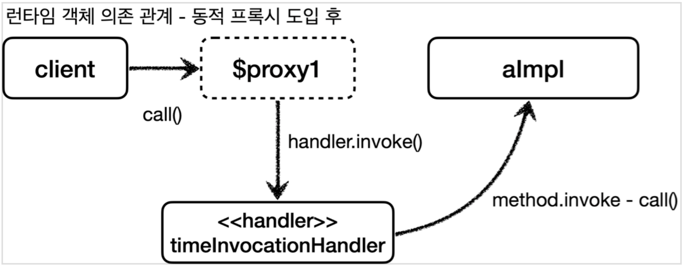

# proxy-decorator-pattern

### 프록시 패턴

- 접근 제어가 목적
  - 권한에 따른 접근 차단
  - 캐싱
  - 지연로딩

### 데코레이터 패턴

- 새로운(부가) 기능 추가가 목적 
  - 원래 서버가 제공하는 기능에 더해서 부가 기능을 수행한다
  - 요청 값이나, 응답 값을 중간에 변형한다
  - 실행 시간을 측정해서 추가 로그를 남긴다

### Reflection

- 클래스의 메타정보를 사용해 동적으로 객체를 생성하거나 메서드를 실행할 수 있다
- 컴파일 에러로 잡히지 않는 버그를 양산할 수 있기 때문에 매우 주의해야한다 

### Dynamic Proxy

- 실행 순서

1. 클라이언트 JDK 동적 프록시의 `call()`을 실행한다
2. JDK 동적 프록시는 `InvocationHandler.invoke()`를 호출한다. (예제의 경우 `TimeInvocationHandler`가 구현체로 있으므로 `TimeInvocationHandler.invoke()`가 호출된다)
3. `TimeInvocationHandler`가 내부 로직을 수행하고 `method.invoke(target, args)`를 호출해서 `target`인 실제 객체(`AImpl`)를 호출한다.
4. `AImpl` 인스턴스의 `call()`이 실행된다
5. `AImpl` 인스턴스의 `call()`의 실행이 끝나면 `TimeInvocationHandler`로 응답이 돌아온다. (시간 로그를 출력하고 결과를 반환)

